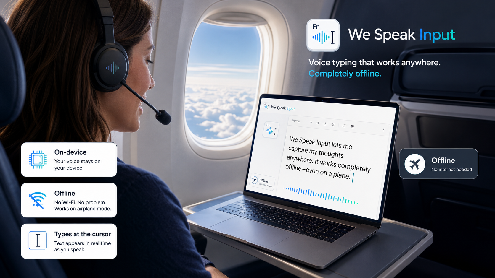
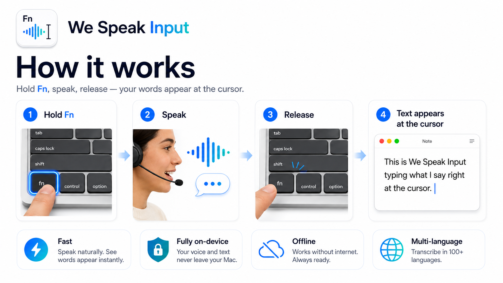
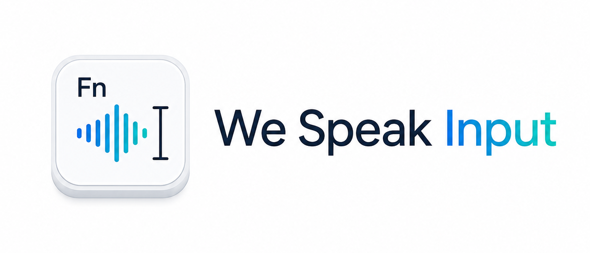
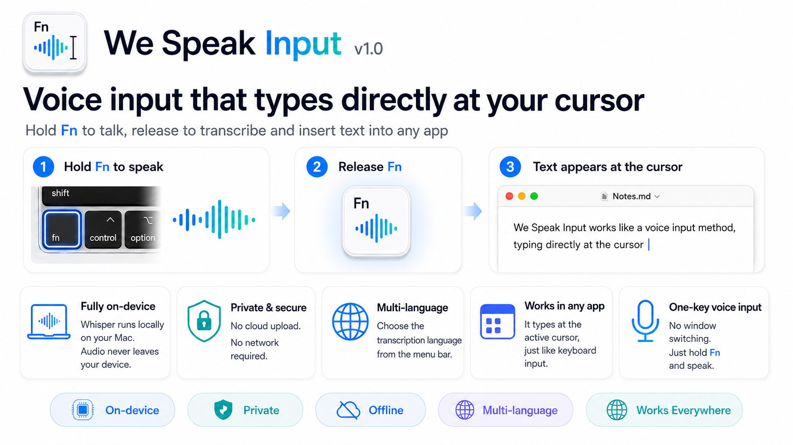

  

  

  

# We Speak Input

*[English](#english) · [中文](#中文)*

> Downloads & release notes. 本仓库用于下载与发布说明。

---

## English

  

**Hold the Fn key to talk, release to turn your speech into text** — like an input method, it types what you say directly at the cursor in any app.

### Overview

We Speak Input is a voice-input tool for macOS. It works like an input method: instead of typing, just press the Fn key and start talking. Your speech is automatically transcribed into text and inserted at the current cursor position.

### Features

- 🎙️ **One-key voice input** — press Fn to talk, release to transcribe.
- 🌍 **Multiple languages** — choose which languages to recognize from the menu bar (multi-select); recognition stays focused on just those.
- 🈺 **Bilingual interface** — switch the app's UI between 中文 and English (or follow the system language).
- 🔒 **Runs locally, privacy-friendly** — speech recognition happens on-device; audio is never uploaded to the cloud.
- ⌨️ **Input-method-like experience** — the transcribed text is typed at the cursor, so it works in any app.

### How it works

Transcription is powered by a locally bundled **Whisper** model (`large-v3-turbo`) and runs **fully offline** — no internet connection required. Everything happens on your Mac; audio never leaves the device.

From the menu bar you can pick which languages to recognize (multi-select). When more than one is selected, the app detects which of *your selected* languages is being spoken and transcribes accordingly.

### Installation

1. Download the latest `.dmg` from the [Releases](https://github.com/gtxistxgao/we-speak-input-releases/releases) page.
2. Open the `.dmg` and drag **We Speak Input** into your **Applications** folder.
3. Launch the app from Applications. On first launch, macOS may warn that the app is from an unidentified developer — right-click the app and choose **Open**, then confirm.
4. Grant the required permissions when prompted (see [Requirements](#requirements)).

### Usage

1. Open the We Speak Input app.
2. From the **menu bar at the top of your Mac screen**, pick which languages to recognize (multi-select). You can also set the interface language there.
3. Place your cursor anywhere you can type text (a chat box, document, search field, etc.).
4. Press the **Fn key** and start talking; when you finish, release it and your speech is transcribed and typed in as text.

> **If the 🌐 / Fn key doesn't trigger voice input:** the key may be taken over by the system (pressing it opens the emoji picker, switches the input source, or starts Dictation). Open *System Settings → Keyboard → "Press 🌐 key to"* and set it to **Do Nothing**. The first-launch guidance shows this hint too, and you can reopen it any time from the menu bar (**"🌐/Fn key not working? Set to Do Nothing…"**).

### Requirements

- macOS 13 (Ventura) or later · Apple Silicon & Intel (universal).
- **Microphone** permission — to record your voice.
- **Accessibility** permission — to receive the global Fn-key events and to type the transcribed text into other apps.

You can grant these under *System Settings → Privacy & Security → Microphone / Accessibility*. On first launch the app guides you through both prompts; if you miss them, the menu bar shows a one-click button to grant each one.

### License

© 2026 We Speak Input. All rights reserved.

---

## 中文

  

按住 **Fn 键说话，松开即把语音转写成文本** —— 像输入法一样把你说的话直接输入到任意应用的光标处。

### 简介

We Speak Input 是一款 macOS 上的语音输入工具。它的工作方式类似输入法：你不需要打字，只要按下 Fn 键开始说话，工具就会自动把你的语音转写成文字并输入到当前光标所在的位置。

### 功能特性

- 🎙️ **一键语音输入**：按下 Fn 键即可说话，松开后自动转写为文本。
- 🌍 **多语言识别**：在菜单栏勾选要识别的语言（可多选），识别只聚焦在所选语言上。
- 🈺 **界面中英双语**：在菜单栏切换界面语言（中文 / English，或跟随系统）。
- 🔒 **本地运行，保护隐私**：语音识别在本地完成，音频不会上传到云端。
- ⌨️ **类输入法体验**：转写结果直接输入到当前光标处，可用于任意应用。

### 技术实现

转写由**随应用打包的本地 Whisper 模型**（`large-v3-turbo`）完成，**完全离线、无需联网**；全部处理都在你的 Mac 上进行，音频不离开本机。

你可以在菜单栏勾选要识别的语言（可多选）。选了多种语言时，应用会在**你勾选的语言范围内**判定当前说的是哪一种并据此转写。

### 安装步骤

1. 前往 [Releases](https://github.com/gtxistxgao/we-speak-input-releases/releases) 页面下载最新的 `.dmg` 安装包。
2. 打开 `.dmg`，将 **We Speak Input** 拖入 **「应用程序」（Applications）** 文件夹。
3. 从「应用程序」中启动。首次打开时，macOS 可能提示应用来自身份不明的开发者——右键点击应用并选择 **「打开」**，然后确认即可。
4. 根据提示授予所需权限（见下方 [系统要求](#系统要求)）。

### 使用方法

1. 打开 We Speak Input 软件。
2. 在 **Mac 屏幕最上方的菜单栏** 中勾选要识别的语言（可多选），也可在此设置界面语言。
3. 把光标放到任意可输入文本的位置（聊天框、文档、搜索框等）。
4. 按下 **Fn 键** 开始说话，说完后松开，语音会自动转写并输入为文本。

> **如果按下 🌐 / Fn 键没有触发语音输入：** 该键可能已被系统占用（按下时会弹出表情面板、切换输入法或触发听写）。请打开 *系统设置 → 键盘 →「按下🌐键时」*，将其设为 **「无操作」（Do Nothing）**。首次启动的引导中也会出现此提示，你也可以随时从菜单栏重新打开（**「🌐/Fn 键无反应？设为『无操作』…」**）。

### 系统要求

- macOS 13 (Ventura) 及以上 · 支持 Apple Silicon 与 Intel（通用二进制）。
- **麦克风** 权限：用于录音。
- **辅助功能（Accessibility）** 权限：用于接收全局 Fn 键事件，并把转写结果输入到其他应用。

可在 *系统设置 → 隐私与安全性 → 麦克风 / 辅助功能* 中授予以上权限。首次启动时应用会引导你完成两项授权；若错过，菜单栏中也提供一键授予的入口。

### 许可证

© 2026 We Speak Input. 保留所有权利。
